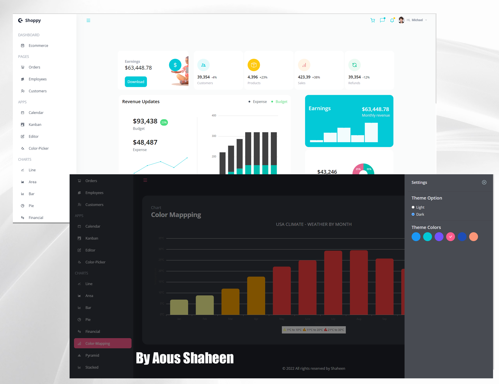
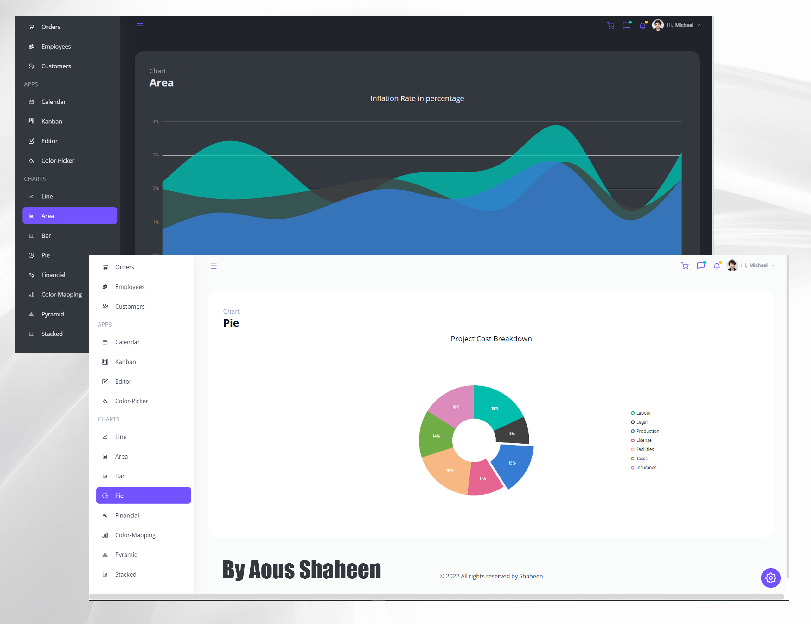

# Build and Deploy a React Admin Dashboard App With Theming, Tables, Charts, Calendar, Kanban and More

## Welcome! 👋
Thanks for checking out this Application.

## Overview

### Links

- Solution URL: [Github](https://github.com/Shaheen121/React-Admin-Dashboard-App.git)
- Live Site URL: [Live Site](https://react-admin-dashboard-app-synch.netlify.app/)

## My process

### Built with

- React Js
- Syncfusion
- Tailwind Css
- JavaScript
- JSX

## Author

- Linkedin - [@aous-shaheen-381636221](https://www.linkedin.com/in/aous-shaheen-381636221/)
- Facebook - [@aoushaheen7](https://www.facebook.com/shaheen7tl/)

By me 🚀🚀🚀
Aous Shaheen